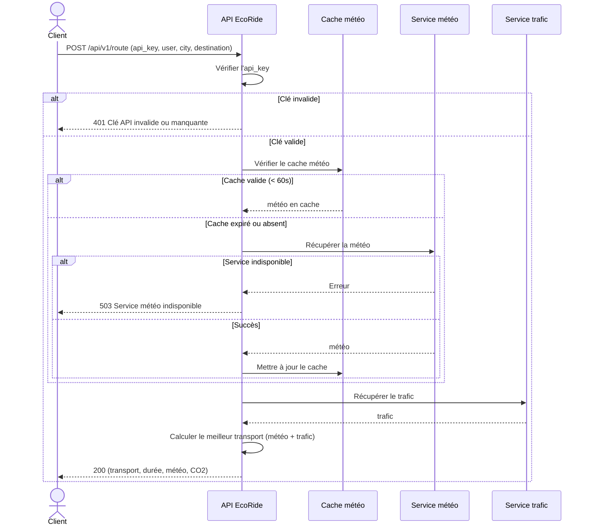

# EcoRide

EcoRide est une API qui aide les utilisateurs à choisir le mode de transport le plus adapté selon:

- **Condition météo** (pluie, nuageux, soleil)
- **Situation du trafic** (fluide, saturé)

### Modes de transport disponibles

| Transport                    | Conditions                   |
| ---------------------------- | ---------------------------- |
| Métro / Tram                 | Pluie + Trafic saturé        |
| Voiture Électrique (Partage) | Pluie + Trafic fluide        |
| Vélo Électrique              | Pas de pluie + Trafic saturé |
| Vélo Standard                | Pas de pluie + Trafic fluide |

## Technologies

- FastAPI
- Pydantic
- AsyncIO
- Uvicorn

## Installation

### Prérequis

- Python 3.8+
- pip

### Étapes

```bash
# Créer l'environnement virtuel
python -m venv venv
venv\Scripts\activate   # Windows
source venv/bin/activate  # Linux / macOS

# Installer les dépendances
pip install fastapi uvicorn pydantic

# Lancemer l'api
python main.py
```

> Le serveur démarre sur `http://localhost:8000`

## Diagramme de séquence



## Documentation

- [API.md](API.md) : détails des endpoints
- [CHANGELOG.md](CHANGELOG.md) : historique des versions
- La doc Swagger est disponible sur http://localhost:8000/docs
